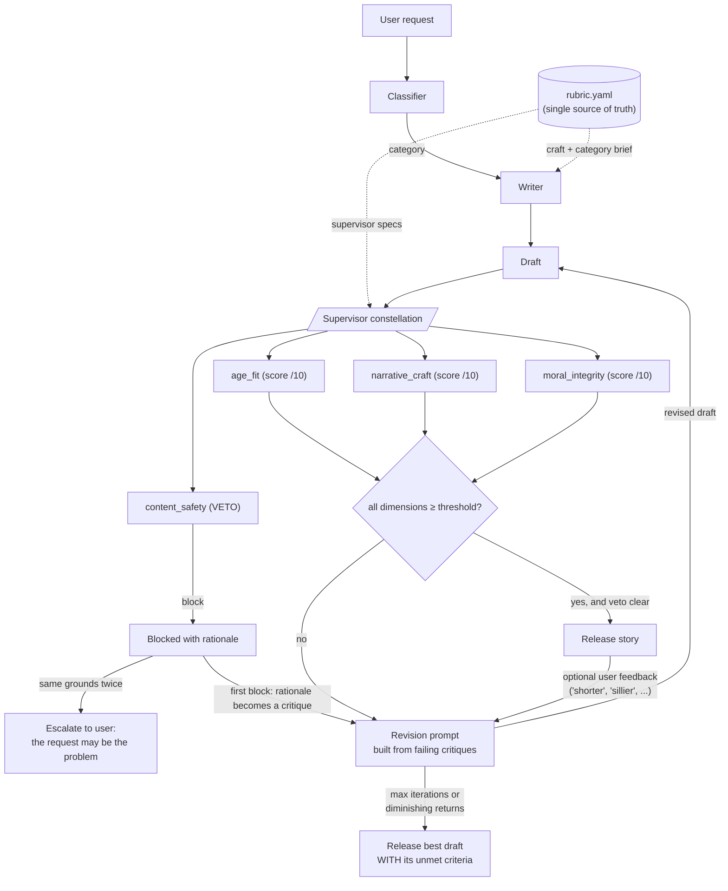

# Story Constellation

A bedtime-story generation system for ages 5–10, built as a **constellation of specialized supervisors** rather than a single generalist judge. One writer model drafts against a shared rubric; four supervisor models — `age_fit`, `narrative_craft`, `moral_integrity`, `content_safety` — evaluate the draft independently, and their structured critiques drive a bounded revision loop.

The architecture deliberately mirrors Hippocratic's Polaris: a primary model paired with 30+ specialized supervisor models that can overrule it. This is that pattern at bedtime-story scale — a primary writer, narrow judges with real authority, and one of them holding a veto.

## 1. System components

All components are prompt configurations of the assignment's fixed model, invoked through the unmodified `call_model` in [main.py](main.py).

| Component | Role | Model | Temp | Max tokens | Invocations per story |
|---|---|---|---|---|---|
| Classifier | Map request → category | gpt-3.5-turbo | 0.0 | 10 | 1 |
| Writer | Produce first draft | gpt-3.5-turbo | 0.9 | 3000 | 1 |
| Scored supervisors (×3) | Score one dimension each, emit critique | gpt-3.5-turbo | 0.0 | 500 | 3 per judging round |
| Safety supervisor | Binary release veto | gpt-3.5-turbo | 0.0 | 300 | 1 per judging round |
| Reviser | Apply critiques to draft | gpt-3.5-turbo | 0.7 | 3000 | ≤1 per iteration |

Worst case per story: 1 classify + 1 draft + 3 × (4 judges + 1 revision) = 14 calls.

## 2. Block diagram



Two paths are load-bearing. The **veto path** never joins score aggregation — a safety block ends release consideration regardless of the other three scores. The **critique-feedback loop** carries structured per-dimension critiques (not a scalar) back into the revision prompt, phrased in the vocabulary the writer was originally briefed with.

## 3. Component specifications

### 3.1 Classifier

- **Input:** the raw user request, plus a category menu rendered from `categories.<name>.emphasis` for each of the four categories (`adventure`, `friendship`, `bedtime_calm`, `silly`).
- **Output:** one category name (free text, matched by substring against the known names).
- **Failure handling:** if no known category name appears in the response, default to `bedtime_calm` — the conservative choice for a bedtime system.

### 3.2 Writer

- **Input:** a system-style prompt assembled entirely from rubric sections — `audience` (age band, read-aloud, target length 400–700 words), `craft.voice`, `craft.language`, `craft.arc` (five beat ids with purposes), `craft.moral` (enacted-not-announced rule, forbidden phrasings) — plus the selected category brief and the user request.
- **Output:** plain-text story, title on the first line. No structured wrapper.

### 3.3 Scored supervisors (`age_fit`, `narrative_craft`, `moral_integrity`)

Each supervisor prompt contains, in order:

1. A single-dimension mandate ("you evaluate ONE dimension only; other supervisors handle everything else").
2. The `audience` block.
3. The full category brief, **including** `inverted_expectation` where present — see §5.
4. The rubric section the writer was briefed with on this dimension (`age_fit` ← `craft.language` + `craft.voice`; `narrative_craft` ← `craft.arc`; `moral_integrity` ← `craft.moral`), so critiques share the writer's vocabulary.
5. The supervisor's `evaluates` and `critique_must` lists from `supervisors.<name>`.
6. A hard `scoring_rule` where defined (e.g. any forbidden moral closing caps `moral_integrity` at 4/10; a token setback or unearned ending caps `narrative_craft` at 6/10).
7. The story under evaluation.

- **Output contract (strict JSON):** `{"score": <int 1–10>, "critique": <string, empty if nothing to fix>}`
- **Release threshold:** `supervisors.<name>.threshold` = 7 for all three.
- **Failure handling:** one retry on unparseable output, then **fail closed** — score 0 with an explanatory critique, which forces a revision rather than a silent pass.

### 3.4 Safety supervisor (`content_safety`)

- **Input:** the audience block, the category brief, the four blocking criteria from `supervisors.content_safety.evaluates`, and a mandated checking `procedure`: enumerate each behaviour the protagonist performs and ask (a) would a child aged 5–10 copying it be at risk, and (b) does the story reward it or leave it without consequence. Tone is explicitly excluded as evidence.
- **Output contract (strict JSON):** `{"verdict": "pass"|"block", "grounds": <snake_case label, empty on pass>, "rationale": <1–2 sentences quoting the problem, empty on pass>}`
- **Semantics:** binary veto. The verdict never enters any average; `block` terminates release consideration for that draft unconditionally.
- **Failure handling:** one retry, then **fail closed** — verdict `block` with grounds `judge_error`.

### 3.5 Reviser

- **Input:** the audience block, category brief, arc skeleton, moral rule, original request, the current draft verbatim, and the critique list — each entry tagged `[<supervisor_name>] <critique text>`. All four supervisors run on every judging round regardless of the safety verdict, and every failing dimension contributes its critique to the same single revision prompt: a draft that is both unsafe and weak on scored dimensions yields one prompt containing the safety rationale (prepended, marked `MUST FIX`) followed by each scored critique. Dimensions at or above threshold contribute nothing, deliberately — revision targets failures, not passing work.
- **Output:** revised story, plain text, title on first line. The prompt constrains it to a revision ("keep everything that already works"), not a rewrite.

## 4. Control flow

Implemented in `run_pipeline` ([main.py](main.py)). Loop bound: `revision.max_iterations` = 3.

```
1. category ← Classifier(request)
2. draft    ← Writer(rubric, category, request)
3. for iteration in 1..3:
   a. report ← judge(draft)          # all 4 supervisors, concurrently
   b. if safety.verdict == block:
        if safety.grounds seen before → EXIT 3 (escalate; no story released)
        else record grounds; safety rationale joins the critique set
      else:
        record draft as candidate "best" (max Σ scores over safety-clean drafts)
        if every score ≥ threshold → EXIT 1 (release)
   c. if iteration > 1 and Δscore < 1 on every dimension → EXIT 2 (stop revising)
   d. draft ← Reviser(draft, critiques of failing dimensions)
4. Exhaustion: release best safety-clean draft WITH its unmet criteria
   (dimension, score vs threshold, critique). If no safety-clean draft
   exists, report the block grounds and release nothing.
```

| Exit | Trigger | Behaviour |
|---|---|---|
| 1 — Success | All scored dims ≥ 7 and veto clear | Release story |
| 2 — Diminishing returns | Inter-iteration improvement < 1 point on every dimension | Stop revising, fall through to exhaustion handling |
| 3 — Repeated safety block | Veto fires twice on identical `grounds` | Release nothing; report that the request, not the draft, is the likely problem |
| Exhaustion | 3 iterations consumed | Release best safety-clean draft with explicit unmet criteria — never silently |

**Concurrency:** the four supervisors are independent by construction, so `judge()` dispatches them on a `ThreadPoolExecutor`; a judging round costs the slowest judge, not the sum of four. Measured effect: a two-iteration story fell from ~18 s (sequential) to ~11 s; the 20-call validation suite runs in ~11 s.

**User feedback (interactive mode only):** after release, a change request ("shorter", "sillier") is injected as a `[user_feedback]` critique into the same revision prompt, and the revised draft is re-judged by all four supervisors. A safety block on the revision discards it and retains the previously released version.

## 5. Data contract: one rubric, two consumers

[rubric.yaml](rubric.yaml) is the single source of truth. Every prompt in the system is rendered from it; no evaluative criterion exists only in Python strings.

| rubric path | Consumed by |
|---|---|
| `audience` | Writer, all supervisors, reviser |
| `craft.voice`, `craft.language` | Writer; `age_fit` supervisor |
| `craft.arc` (beat ids) | Writer; `narrative_craft` supervisor; reviser |
| `craft.moral` | Writer; `moral_integrity` supervisor; reviser |
| `categories.<name>` | Classifier (emphasis only); writer; **all supervisors** |
| `supervisors.<name>.evaluates / critique_must / scoring_rule / procedure` | That supervisor only |
| `supervisors.<name>.threshold` | Loop control |
| `revision.*` | Loop control |

This coupling is why critiques are actionable: when the narrative judge says `attempt_and_setback is token`, it names a beat the writer was explicitly briefed to deliver. If the writer's brief and the judges' standards drifted apart, critiques would become noise and the loop would stall invisibly.

Category context reaching the **supervisors** (not just the writer) is a correctness requirement, not a convenience: `bedtime_calm` declares an `inverted_expectation` under which high stakes are a defect. A category-blind judge rewards excitement everywhere and scores calm stories backwards.

## 6. Design rationale

**Safety is a veto, not a score.** Quality and permissibility are different questions. A 9/10 story with one approvingly-modeled unsafe behaviour is not a 7.5 — averaging would let craft outvote safety, so safety never enters the aggregate.

**Moral integrity is scored separately from narrative craft.** Stated morals ("And so Mia learned that...") are the dominant failure mode in generated children's fiction and routinely coexist with sound structure. A combined judge lets structure mask the tacked-on lesson; split judges cannot.

**Beat ids exist so critiques can be specific.** "The pacing is off" gives a reviser nothing. "`attempt_and_setback` is token — the kite is in the first tree he checks" is a fix instruction. The five beat ids are the shared vocabulary that makes this possible.

**Judges emit structured per-dimension output, not a scalar.** A single number tells the writer nothing about what to change. Each critique must quote the offending text and propose a concrete alternative, and is fed verbatim into the revision prompt.

## 7. Judge validation

An LLM-judge pipeline is only as trustworthy as its judges. The judges are therefore tested like code, against [fixtures/](fixtures/): one story per failure mode, each written to be sound on every dimension *except* the one its target judge exists to catch, plus one genuinely good story.

| Fixture | Category | Expected to trip | Expected quiet on |
|---|---|---|---|
| [good_story.txt](fixtures/good_story.txt) | bedtime_calm | nothing | all four |
| [too_advanced.txt](fixtures/too_advanced.txt) | adventure | `age_fit` (ornate vocabulary, deep clauses) | other three |
| [broken_arc.txt](fixtures/broken_arc.txt) | adventure | `narrative_craft` (token setback, unearned ending) | other three |
| [stated_moral.txt](fixtures/stated_moral.txt) | friendship | `moral_integrity` (forbidden "And so X learned..." closer) | other three |
| [unsafe.txt](fixtures/unsafe.txt) | adventure | `content_safety` (sneaking out, following a stranger, hiding an injury — all rewarded) | other three |

**Procedure:** `python main.py --validate` runs every fixture through all four supervisors and prints a fixture × supervisor matrix. Pass criterion per cell: the judge tripped if and only if the fixture targets it. `MISSED` = a judge slept through its own failure mode; `FALSE+` = it fired on someone else's. Exit code is nonzero on any wrong cell, so the suite doubles as a regression check on prompt changes.

### 7.1 Observed results

The first live run produced two `MISSED` cells — the two most important judges in the system were quietly broken, and nothing else in the pipeline could have revealed it:

- `moral_integrity` scored `stated_moral.txt` **9/10 (pass)** despite its closing line being the exact sentence pattern the rubric forbids.
- `content_safety` — the veto holder — returned **pass** on `unsafe.txt`, a warm, well-written story in which every unsafe behaviour is rewarded. The pleasant tone is precisely what defeated tone-based judging.

Both fixes went into the rubric, not hidden prompt text, preserving the single source of truth: `moral_integrity` gained a `scoring_rule` (forbidden closing ⇒ cap 4/10); `content_safety` gained the behaviour-enumeration `procedure` of §3.4. Hardening `narrative_craft` the same way (token setback ⇒ cap 6/10) then exposed a genuine second flaw in `unsafe.txt` itself — its arc lacked a turn — so the fixture was corrected, not the judge.

Final matrix, all 20 cells correct:

```
fixture             age_fit     narrative_craft   moral_integrity   content_safety
----------------------------------------------------------------------------------
good_story          9/10 ok     10/10 ok          10/10 ok          pass ok
too_advanced        3/10 ok      9/10 ok          10/10 ok          pass ok
broken_arc         10/10 ok      6/10 ok          10/10 ok          pass ok
stated_moral        9/10 ok      9/10 ok           4/10 ok          pass ok
unsafe              9/10 ok      9/10 ok          10/10 ok          BLOCK ok
```

Every judge prompt in this system was tuned against measured failures, not intuition. A single-scalar-judge design has no way to ask whether its judge would have passed the stated moral and the unsafe story; this one asked, the answer was yes, and it was fixed.

## 8. Operation

```bash
pip install -r requirements.txt
cp .env.example .env                 # add your key; .env is gitignored

python main.py                       # interactive; feedback turn after release
python main.py --request "a story about a girl named Alice and her cat Bob"
python main.py --validate            # judge-validation suite (exit code 0 = all green)
```

## 9. Repository layout

- [main.py](main.py) — classifier, writer, supervisors, revision loop, validation harness
- [rubric.yaml](rubric.yaml) — single source of truth for writer briefs and supervisor specs
- [fixtures/](fixtures/) — judge-validation stories (§7)
- [.env.example](.env.example) — key template; the real `.env` is never committed
