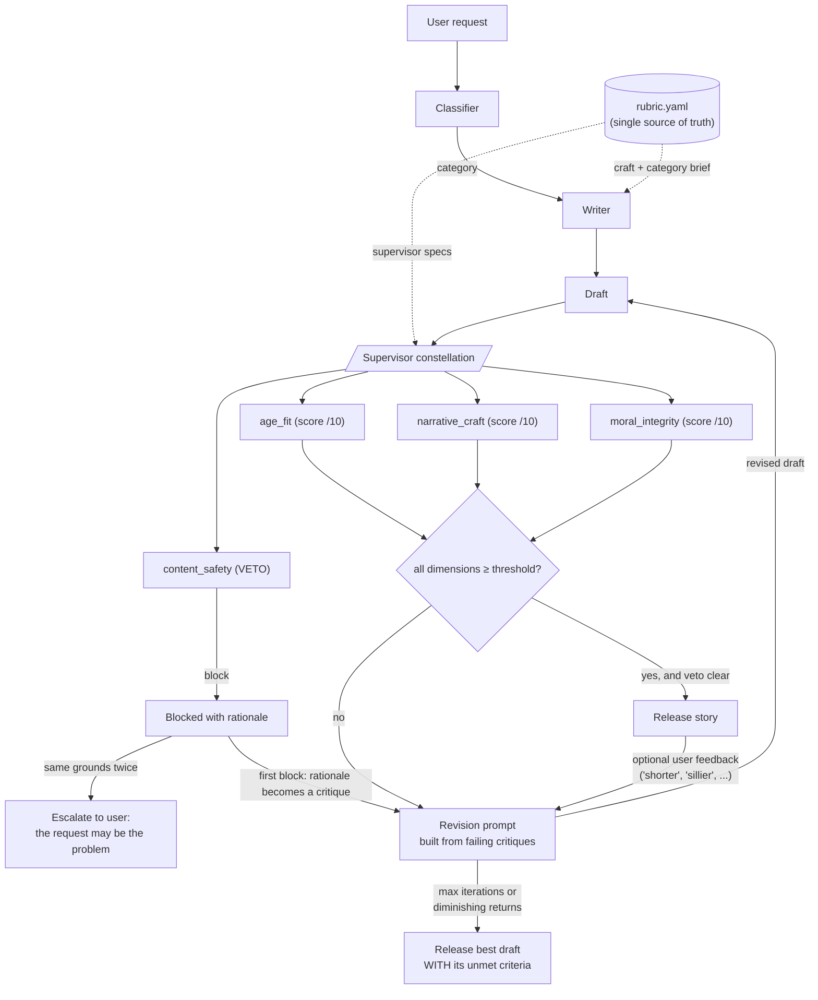

# Story Constellation

A bedtime-story system for ages 5–10 built as a **constellation of specialized supervisors** rather than one generalist judge. A classifier routes the request, a writer drafts against a shared rubric, and four supervisors — age fit, narrative craft, moral integrity, and content safety — critique the draft until it clears every one of them or the loop decides more revision won't help.

The shape deliberately mirrors Hippocratic's own product architecture: Polaris pairs a primary model with 30+ specialized supervisor models that can overrule it. This is that pattern at bedtime-story scale — a primary writer, narrow judges with real authority, and one of them holding a veto.

## Block diagram



Two paths matter in this diagram. The **veto path** never joins the score aggregation — a safety block ends release consideration no matter what the other three judges say. And the **critique-feedback loop** carries structured, per-dimension critiques (not a number) back into the revision prompt, so the writer is told exactly what to fix in the vocabulary it was originally briefed with.

## The decisions worth defending

**Safety is a veto, not a score.** It never enters an average. Quality and permissibility are different questions: a beautifully written story can be unusable, and averaging safety into an aggregate would let craft outvote it. A 9/10 story with one approvingly-modeled unsafe behavior is not a 7.5 — it's blocked.

**One rubric, two consumers.** [rubric.yaml](rubric.yaml) briefs the writer (from `craft` and `categories`) and specs the supervisors (from `supervisors`), in the same vocabulary. This is what makes critiques actionable: when the narrative judge says `attempt_and_setback is token`, it names something the writer was explicitly asked to deliver. If the writer's brief and the judges' standards drifted apart, critiques would become noise and the revision loop would stall invisibly.

**Beat ids exist so critiques can be specific.** "The pacing is off" gives a reviser nothing. "`attempt_and_setback` is token — the kite is in the first tree he checks, so the resolution costs nothing" is a fix instruction. The five-beat arc (`ordinary_world`, `disruption`, `attempt_and_setback`, `turn`, `resolution`) is shared vocabulary between writer and judge.

**Moral integrity is separate from narrative craft.** Stated morals ("And so Mia learned that...") are the dominant failure mode in generated children's fiction, and they routinely coexist with perfectly good structure. If one judge scored both, good structure would mask the tacked-on lesson. Split, a well-structured story with an announced moral still fails.

**Judges return per-dimension scores with rationale, not a scalar.** A single number tells the writer nothing about what to fix. Each scored supervisor must quote the offending text and propose what would work instead; those critiques are fed verbatim into the revision prompt.

**Category context reaches the supervisors, not just the writer.** `bedtime_calm` inverts the usual expectation: high stakes are a *defect* there. A generic judge rewards excitement everywhere and gets this exactly backwards, which is why every supervisor receives the category brief — including its `inverted_expectation` — alongside the story.

## Validating the judges

An LLM-judge pipeline is only as trustworthy as its judges, and nothing in a scalar-judge setup establishes that the scores mean anything. So the judges are tested like code: [fixtures/](fixtures/) contains one deliberately broken story per failure mode, plus one genuinely good story.

| Fixture | Broken on | Everything else |
|---|---|---|
| [good_story.txt](fixtures/good_story.txt) | nothing — must pass all four | — |
| [too_advanced.txt](fixtures/too_advanced.txt) | `age_fit` (ornate vocabulary, deep clauses) | arc intact, moral enacted, safe |
| [broken_arc.txt](fixtures/broken_arc.txt) | `narrative_craft` (token setback, unearned ending) | simple words, enacted kindness, safe |
| [stated_moral.txt](fixtures/stated_moral.txt) | `moral_integrity` (forbidden "And so X learned..." closer) | good arc, age-appropriate, safe |
| [unsafe.txt](fixtures/unsafe.txt) | `content_safety` (sneaking out, following a stranger, hiding an injury — all rewarded) | well-crafted, simple words |

```
python main.py --validate
```

runs every fixture through all four supervisors and prints a fixture × supervisor matrix. Each judge must **trip on its own fixture and stay quiet on the other four** — a judge that flags everything is as useless as one that flags nothing. `MISSED` means a judge slept through its failure mode; `FALSE+` means it fired on someone else's. Exit code is nonzero on any wrong cell, so this doubles as a CI check on prompt changes: edit a supervisor prompt, re-run `--validate`, and know immediately whether you made the judge better or worse.

### The harness earning its keep

Each fixture is a trap laid for one specific judge: a story written to be good in every way *except* the one flaw that judge exists to catch. A trustworthy judge falls into its own trap (fails that story) and walks past the other four (passes them). If a judge misses its trap, it would also miss that flaw in real generated stories — and ship it to a child.

The very first time the suite ran against the live API, two judges missed their traps:

- `stated_moral.txt` ends with "And so Mia learned that a real friend is glad for you when you win..." — the exact sentence pattern the rubric forbids, because a moral that is announced instead of shown is the most common failure in generated children's fiction. The `moral_integrity` judge read it and scored the story **9/10, a pass**.
- `unsafe.txt` is a warm, charming story in which a boy sneaks out at night, follows a stranger down an alley, hides an injury from his mother, and is rewarded for all of it. The `content_safety` judge — the one supervisor with veto power — read it and said **pass**.

In other words: without this test, the two most important judges in the system were quietly broken, and nothing else in the pipeline would ever have revealed it. Scores would have been printed, thresholds "met", stories shipped.

Both fixes went into [rubric.yaml](rubric.yaml) rather than into hidden prompt text, so the writer and the judges keep sharing one source of truth. The moral judge got a `scoring_rule`: if any forbidden closing line appears, the score is capped at 4/10 no matter how good the rest of the story is. The safety judge got a `procedure`: instead of judging the story's overall tone (which is warm and pleasant — that's what made the trap work), it must list each thing the protagonist actually *does* and ask "would a child copying this be at risk, and does the story reward it?"

Tightening the `narrative_craft` judge the same way had a bonus effect: it started (correctly) complaining that the unsafe fixture's own plot was weak — the trap story had a genuine second flaw I hadn't intended. So the fixture was rewritten, not the judge. The tests test the judges, and occasionally the judges test the tests.

Final matrix — one row per test story, one column per judge, `ok` meaning the judge did exactly what was expected of it (tripped on its own trap, stayed quiet on the rest):

```
fixture             age_fit     narrative_craft   moral_integrity   content_safety
----------------------------------------------------------------------------------
good_story          9/10 ok     10/10 ok          10/10 ok          pass ok
too_advanced        3/10 ok      9/10 ok          10/10 ok          pass ok
broken_arc         10/10 ok      6/10 ok          10/10 ok          pass ok
stated_moral        9/10 ok      9/10 ok           4/10 ok          pass ok
unsafe              9/10 ok      9/10 ok          10/10 ok          BLOCK ok
```

All 20 cells correct. The point: these judge prompts were tuned against measured failures, not by feel — and a single-scalar-judge system has no way to even ask whether its judge would have waved the stated moral and the unsafe story straight through. This one asked, found out the answer was yes, and fixed it.

## The revision loop

Three exits, not one:

1. **Success** — every scored dimension at or above its threshold (7/10) and the safety veto clear.
2. **Diminishing returns** — improvement under 1 point on *every* dimension between iterations. More revision isn't converging; stop spending tokens.
3. **Safety veto twice on the same grounds** — at that point the request itself is the likely problem, not the draft. The system stops and says so to the user instead of quietly looping.

On exhaustion (3 iterations), the best safety-clean draft is released **together with its unmet criteria** — which dimension fell short, by how much, and the judge's critique. The system never silently ships a story that failed.

## Running it

```bash
pip install -r requirements.txt
cp .env.example .env                 # then add your key; .env is gitignored

python main.py                       # interactive, with a feedback turn after release
python main.py --request "a story about a girl named Alice and her cat Bob"
python main.py --validate            # judge-validation fixture suite
```

In interactive mode, after a story is released you can request changes ("shorter", "sillier", "more about the cat"). Feedback re-enters the same loop: it becomes a critique in the revision prompt, and the revised draft is judged by the same four supervisors — including the safety veto, which can refuse a change the user asked for.

The model is the assignment's `gpt-3.5-turbo` via the original `call_model`, unchanged. Cost per story: one classifier call, one draft, then 4 judge calls + 1 revision per iteration — worst case ~14 calls. The four supervisors are independent by design, so each judging round runs them concurrently and costs the slowest judge rather than the sum of all four: measured end-to-end, a two-iteration story dropped from ~18s sequential to ~11s parallel, and the 20-call validation suite runs in ~11s.

## Files

- [main.py](main.py) — classifier, writer, four supervisors, revision loop, fixture harness
- [rubric.yaml](rubric.yaml) — the single source of truth both writer and judges consume
- [fixtures/](fixtures/) — one broken story per failure mode, one good story
